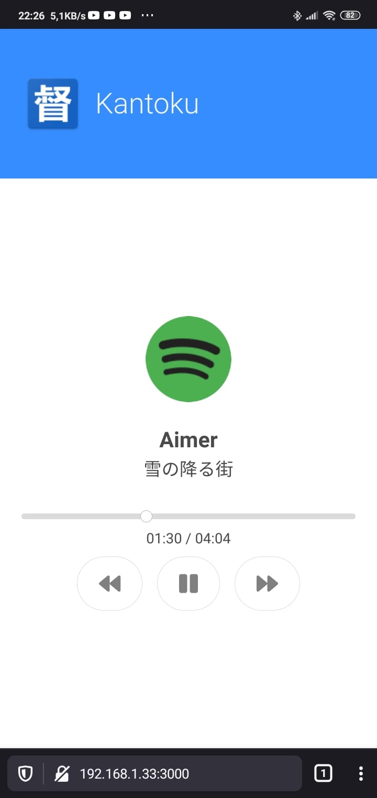

# kantoku
Application for remote media control.

It supports:
* Any Windows program that uses media controls. For example:
  * Spotify
  * Groove Music
  * VLC
  * ...
* Any website that uses a `<video>` element. For example:
  * YouTube
  * Netflix (coming)
  * ...

